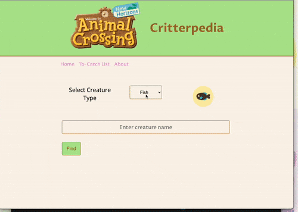
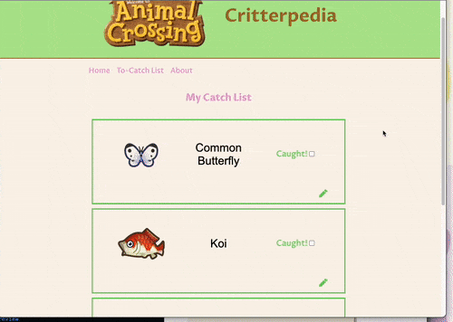

# Critterpedia

Critterpedia is an App for Animal Crossing: New Horizons players who want to know what bugs, fish, and sea creatures are currently available to catch on their island.
Different creatures appear depending on the time of year and day as well as in-game location so this is useful information to keep track of!

## Live Site

Check out Critterpedia [here](https://yunyunliu.github.io/Critterpedia/)!

Use Critterpedia to search for a Critter's availbility information, save Critters you plan on catching to your To-Catch list, and keep track of your Critter-catching progress with notes.

## Technologies Used

- HTML5
- CSS3
- JavaScript
- [ACNH API](http://acnhapi.com/) for Animal Crossing critter data


## Features

- User can search for a fish, bug, or sea creature by name.
- User can view availability data for the fish, bug, or sea creature (ie. Is it available to catch now?)
- User can save a searched Critter and its information to a 'To-Catch List'.
- User can add notes to an item saved to the 'To-Catch List'.
- Users can remove an item from the 'To-Catch List'.

## Preview






## Planned Features

- Adding a backend and database so that the app no longer depends on the browser's local storage for persistent storage.
- Switching to the [Nookipedia API](https://api.nookipedia.com/) to provide more informative search results.

### Getting Started

1. Clone the repository.

    ```shell
    git clone https://github.com/yunyunliu/Critterpedia.git
    cd Critterpedia
    ```

1. Open ```index.html``` in a browser.
